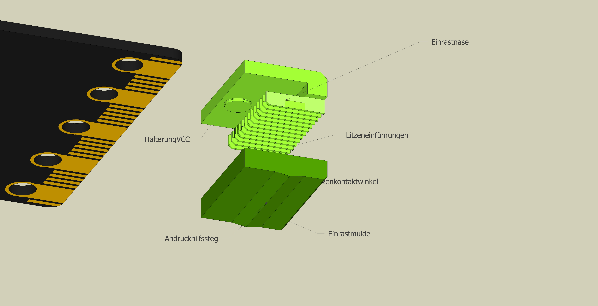

# micro:bit_connector

Ein edge-connector für den micro:bit mit 12 Pins. Das Rastermass ist 1,27 mm
Wenn der connector bei 3V eingerastet wird ergeben sich folgende Pins: 15, 16, VCC, VCC, VCC, VCC, VCC, 19, 20, GND, GND.

 

Der connector soll einmal dazu dienen, zwei oder mehrere micro:bits zu verbinden und damit eine Sanduhr oder "rieselnde Punkte" zu simulieren. Diese Pins wurden gewählt, da sie noch nicht für die LED´s benötigt werden. P19 und P20 sind außerdem für die i2C vorgesehen und können so zahlreiche Sensoren oder auch z. B. OLED-Displays angesteuert werden. Mit den 4 Pins könnte auch eine H-Bridge für einen Stepmotor oder einen Roboter betrieben werden.

Der code für die Sanduhr ist noch nicht fertig, wird dann aber auch hier bei git.hub veröffentlicht. 

## Design ##
mit SketchUp im [erfindergarden](http://www.erfindergarden.de), das FabLab in München. Danke an SketchUp, dass wir für den Untericht mit den Kindern die Pro-Version nutzen dürfen.

  
 

## Produktion ##
Der connector wird **3D-gedruckt**. Da die Struktur sehr fein ist benötigt man auch eine feine, maximal **0,25 mm Düse**. Support ist nicht nötig. **Layerhöhe 0,12 mm**. 

Die Litzen wählt man am besten in unterschiedlichen Farben. Für GND schwarz und für VCC rot. **Um beim Einlegen der Litzen den connector nicht zu beschädigen muss dieser auf den micro:bit aufgesetzt werden.** Die Litzenenden werden auf ca. 10 mm abisoliert und in das Unterteil sorgfälltig eingelegt. Dabei darauf achten, dass die Litzenenden hinten nicht zu weit überstehen und sich dadurch berühren. Der letzte Millimeter muss nach unten abgeknicht werden um ein Herausziehen zu vermeiden. Dann das Oberteil auflegen und festklicken. 

Mit Hilfe eines **Multimeters** kann zwischen den Litzenenden und den Kontrollöchern der Kontakt überprüft werden.